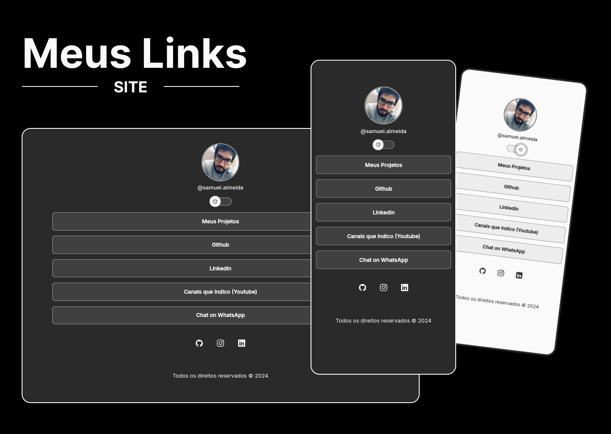

<h1 align="center"> Meu Cartão de Visitas - Online</h1>

  <a href="https://samuelcarneiro.github.io/cartao-visitas-online/">Clique aqui para acessar o site</a>&nbsp;&nbsp;&nbsp;&nbsp;&nbsp;&nbsp;

 

  <a href="#-tecnologias">Tecnologias</a>&nbsp;&nbsp;&nbsp;|&nbsp;&nbsp;&nbsp;
  <a href="#-projeto">Projeto</a>&nbsp;&nbsp;&nbsp;&nbsp;&nbsp;&nbsp;

  

## 🚀 Tecnologias

## 💻 Projeto

Projeto desenvolvido como forma de prática de desenvolvimento front-end pessoal. No site é possível visualizar meus projetos, redes sociais e canais do Youtube que recomendo.
